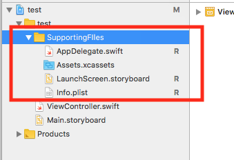
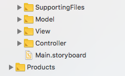

# Swift Programming Style:
1. Using uppercase for types and protocols, lowercase for everything else [1].
2. Using camel case.
3. Indentation : Indent using 2 spaces rather than tabs to conserve space and help prevent line wrapping.[1]
4. Keep imports minimal. For example, don't import UIKit when importing Foundation will suffice.[1]

### Tricks
1. Auto Indentation in Xcode: Control + I 
2. When coding, hold Option button, direct to the Swift API documentation

### How to organize your project
1. For example, you have created a single app application in XCode. => Then you should group some auto provided files such as AppDelegate.swift, LaunchScreen.storyboard, info.plist into <b>SupportingFiles</b> (See image): 
 
=> Also, you need to change the generic ViewController to a more Specific name.

2. If you adopt MVC structure(highly recommended), make sure your project contains Model, View, Controller folder respectively.(See image):
   

### More Readings: 
1. [Swift style guide](https://github.com/raywenderlich/swift-style-guide)
2. [API design guideline](https://swift.org/documentation/api-design-guidelines/)